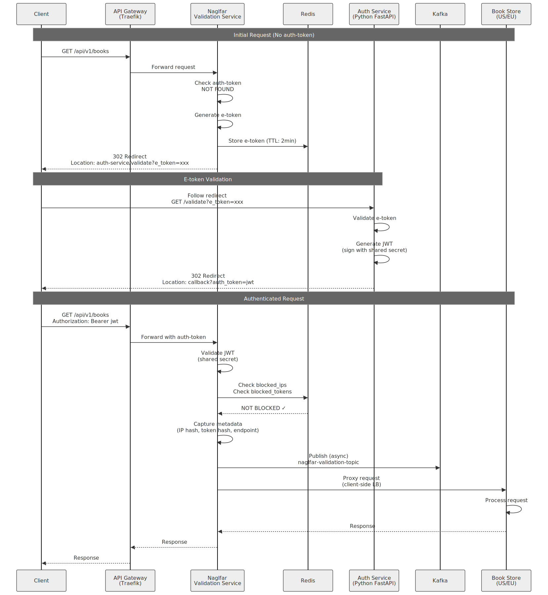
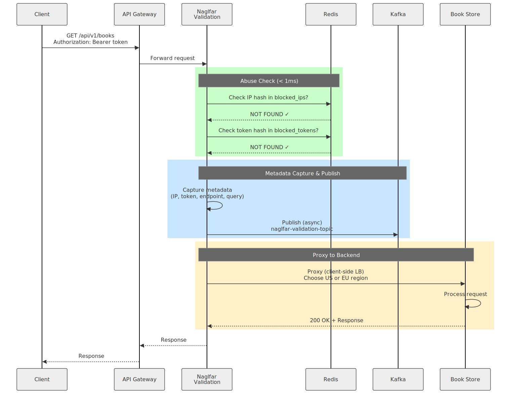
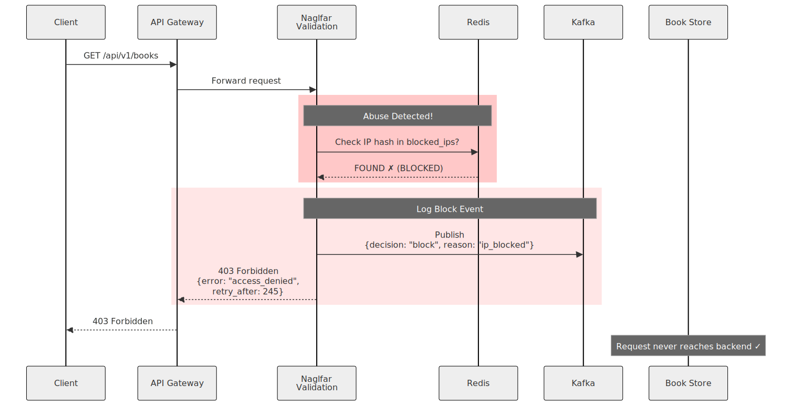
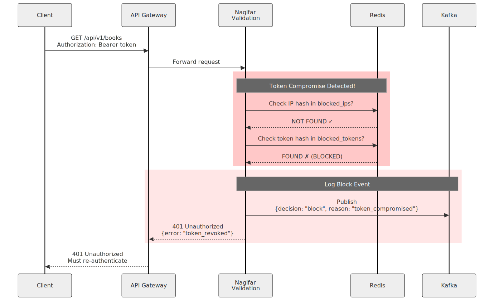

# Naglfar Layer - Detailed Architecture

> **Design Philosophy**: Build analytics capabilities with enhanced visibility to discover attack vectors, then adapt protection strategies based on observed patterns.

**Document Status**: Draft
**Last Updated**: 2025-12-27
**Version**: 0.1.0

---

## Table of Contents
1. [Architecture Overview](#architecture-overview)
2. [Component Details](#component-details)
3. [Authentication Flow](#authentication-flow)
4. [Request Flow](#request-flow)
5. [Data Flow & Analytics Pipeline](#data-flow--analytics-pipeline)
6. [Abuse Detection & Blocking](#abuse-detection--blocking)
7. [Account Compromise Detection](#account-compromise-detection)
8. [Technology Stack](#technology-stack)
9. [Database Schemas](#database-schemas)
10. [Deployment Architecture](#deployment-architecture)

---

## Architecture Overview

### ASCII Diagram

```
┌─────────────────────────────────────────────────────────────────────┐
│                            INTERNET                                 │
└────────────────────────────┬────────────────────────────────────────┘
                             │
                             ▼
┌─────────────────────────────────────────────────────────────────────┐
│                         API GATEWAY                                 │
│                          (Traefik)                                  │
└────────────────────────────┬────────────────────────────────────────┘
                             │
                             ▼
┌─────────────────────────────────────────────────────────────────────┐
│                  NAGLFAR VALIDATION SERVICE                         │
│                   (.NET Proxy + Validation)                         │
│  ┌──────────────────────────────────────────────────────────────┐  │
│  │ 1. Check auth-token                                          │  │
│  │ 2. If missing → generate e-token → redirect to Auth Service │  │
│  │ 3. If present → validate (shared secret)                    │  │
│  │ 4. Check Redis (blocked IPs/tokens)                         │  │
│  │ 5. Capture metadata (IP, token hash, endpoint, query)       │  │
│  │ 6. Publish to Kafka                                         │  │
│  │ 7. Proxy to Book Store (client-side load balancing)        │  │
│  └──────────────────────────────────────────────────────────────┘  │
└─────┬───────────────────────────────────────────────────┬───────────┘
      │                                                     │
      │ e-token redirect                                   │ Proxy to backend
      ▼                                                     ▼
┌─────────────────┐                          ┌──────────────────────────┐
│  AUTH SERVICE   │                          │   BOOK STORE BACKEND     │
│ (Python+FastAPI)│                          │   (2 Regions: US, EU)    │
│  3rd Party      │                          │                          │
│  • Validate     │                          │  • Business logic        │
│    e-token      │                          │  • Inventory, cart,      │
│  • Generate     │                          │    checkout              │
│    auth-token   │                          │  • Publish user actions  │
│  • Shared secret│                          │    to Kafka with email   │
└─────────────────┘                          └──────────┬───────────────┘
                                                        │
      ┌─────────────────────────────────────────────────┘
      │
      │ Events: validation requests + user journey events
      ▼
┌─────────────────────────────────────────────────────────────────────┐
│                          KAFKA CLUSTER                              │
│  Topics:                                                            │
│  • naglfar-validation-topic (from Validation Service)              │
│  • naglfar-user-journey-topic (from Book Store Backend)            │
└────────────┬────────────────────────────────────────────────────────┘
             │
             │ Consumed by workers
             ▼
┌─────────────────────────────────────────────────────────────────────┐
│                        NAGLFAR WORKER                               │
│                          (.NET Consumer)                            │
│  • Reads from naglfar-validation-topic                             │
│  • Reads from naglfar-user-journey-topic                           │
│  • Writes to Neo4j graph database                                  │
│  • Enriches data, correlates events                                │
└────────────┬────────────────────────────────────────────────────────┘
             │
             │ Stores in graph
             ▼
┌─────────────────────────────────────────────────────────────────────┐
│                       NEO4J GRAPH DATABASE                          │
│  Stores:                                                            │
│  • Request metadata (IP, auth-token hash, endpoint, timestamp)     │
│  • User journeys (actions, sequences, timing)                      │
│  • Relationships (IP→Token, Token→Account, Account→Actions)        │
│  • Patterns (similar journeys, token reuse, anomalies)             │
└────────────┬────────────────────────────────────────────────────────┘
             │
             │ Analyzed by
             ▼
┌─────────────────────────────────────────────────────────────────────┐
│                   NAGLFAR ANALYTICS WORKER                          │
│                     (Pattern Detection)                             │
│  • Analyzes Neo4j graph                                            │
│  • Detects abuse patterns:                                         │
│    - Same auth-token used by multiple accounts/IPs                 │
│    - Suspicious user journey patterns                              │
│    - High-frequency requests from single IP                        │
│    - Account compromise indicators                                 │
│  • Writes decisions to Redis (IPs to block, tokens to block)       │
└────────────┬────────────────────────────────────────────────────────┘
             │
             │ Writes block lists
             ▼
┌─────────────────────────────────────────────────────────────────────┐
│                         REDIS CACHE                                 │
│  Storage modes (configurable):                                     │
│  • Raw data: exact IP addresses and token hashes                   │
│  • Bloom filter: probabilistic data structure (memory efficient)   │
│                                                                     │
│  Data:                                                              │
│  • blocked_ips (set or bloom filter)                               │
│  • blocked_tokens (set or bloom filter)                            │
│  • block_expiry (TTL: 5 minutes)                                   │
└─────────────────────────────────────────────────────────────────────┘
             ▲
             │
             │ Fast lookups (< 1ms)
             │
┌────────────┴────────────────────────────────────────────────────────┐
│              NAGLFAR VALIDATION SERVICE                             │
│              (reads Redis before allowing requests)                 │
└─────────────────────────────────────────────────────────────────────┘
```

### System Architecture Diagram

Shows the complete Naglfar protection system with all components: API Gateway (Traefik), Naglfar Validation Service, Auth Service, Book Store backends (US/EU), Kafka message broker, processing workers (Naglfar Worker and Analytics Worker), and data storage (Neo4j graph database and Redis cache). Illustrates the request flow from internet through authentication, validation, proxying to backend, event streaming, graph analytics, and block enforcement.



---

## Component Details

### 1. Naglfar Validation Service (.NET)

**Responsibilities:**
- Act as reverse proxy to Book Store backend
- Manage authentication flow (E-TOKEN header generation, AUTH-TOKEN header validation)
- Check Redis for blocked IPs/tokens
- Capture request metadata
- Publish events to Kafka
- Client-side load balancing to Book Store regions

**Tech Stack:**
- .NET 10.0
- YARP (Yet Another Reverse Proxy) or custom proxy
- Kafka producer (Confluent.Kafka)
- Redis client (StackExchange.Redis)
- Bloom filter library (optional)

**Configuration Flags:**
```yaml
redis:
  mode: raw  # or "bloom-filter"
  ttl: 300   # 5 minutes in seconds

blocking:
  e_token_block_duration: 300  # 5 minutes
  auth_token_block_duration: 300  # 5 minutes

auth:
  shared_secret: "${SHARED_SECRET}"  # shared with Auth Service
  auth_service_url: "http://auth-service/validate"

backend:
  regions:
    - url: "http://bookstore-us"
      weight: 50
    - url: "http://bookstore-eu"
      weight: 50
  load_balancing: "round-robin"  # or "random", "weighted"
```

**Key Operations:**

1. **E-TOKEN Generation:**
   - Generate cryptographically secure random token (UUID)
   - **ALWAYS create new** - ignore any existing E-TOKEN (prevents session fixation)
   - Set E-TOKEN as response header
   - Return 302 redirect to Auth Service with e_token query parameter

2. **AUTH-TOKEN Validation:**
   - Check for AUTH-TOKEN in request header (not cookie)
   - Verify HMAC signature using shared secret
   - Check expiration timestamp
   - Validate claims

3. **Abuse Check (Redis lookup):**
   - Hash client IP
   - Check if IP hash in `blocked_ips` (raw or bloom filter)
   - Hash auth-token
   - Check if token hash in `blocked_tokens` (raw or bloom filter)

4. **Metadata Capture:**
   ```json
   {
     "request_id": "uuid",
     "timestamp": "2025-12-27T14:30:00Z",
     "client_ip_hash": "sha256(ip)",
     "auth_token_hash": "sha256(token)",
     "endpoint": "/api/v1/books",
     "query_string": "?page=1&limit=20",
     "http_method": "GET",
     "user_agent_hash": "sha256(user-agent)",
     "region_proxied": "us"
   }
   ```

5. **Kafka Publishing:**
   - Topic: `naglfar-validation-topic`
   - Partition key: `client_ip_hash` (for ordered processing per IP)
   - Async publish (fire and forget, with error logging)

---

### 2. Auth Service (Python + FastAPI - 3rd Party)

**Responsibilities:**
- Validate e-tokens
- Generate auth-tokens (JWT)
- Share secret with Naglfar Validation Service

**Tech Stack:**
- Python 3.11+
- FastAPI
- PyJWT (for auth-token generation)

**API Endpoints:**
```
POST /auth/validate
  Request:
    {
      "e_token": "string"
    }
  Response:
    {
      "auth_token": "jwt-string",
      "expires_in": 3600
    }
```

**Auth-token Format (JWT):**
```json
{
  "sub": "user-id",
  "email": "user@example.com",
  "iat": 1735308600,
  "exp": 1735312200,
  "iss": "auth-service"
}
```

**Shared Secret:**
- Symmetric key (HMAC-SHA256)
- Stored in environment variable
- Used to sign auth-tokens
- Naglfar Validation Service uses same secret to verify

---

### 3. Kafka Cluster

**Topics:**

#### `naglfar-validation-topic`
- **Producer**: Naglfar Validation Service
- **Consumer**: Naglfar Worker
- **Partitions**: 10 (for parallelism)
- **Retention**: 7 days
- **Message Schema**:
  ```json
  {
    "request_id": "uuid",
    "timestamp": "iso8601",
    "client_ip_hash": "sha256",
    "auth_token_hash": "sha256",
    "endpoint": "string",
    "query_string": "string",
    "http_method": "string",
    "user_agent_hash": "sha256",
    "region_proxied": "string",
    "decision": "allow|block",
    "block_reason": "string|null"
  }
  ```

#### `naglfar-user-journey-topic`
- **Producer**: Book Store Backend
- **Consumer**: Naglfar Worker
- **Partitions**: 10
- **Retention**: 7 days
- **Message Schema**:
  ```json
  {
    "event_id": "uuid",
    "timestamp": "iso8601",
    "auth_token_hash": "sha256",
    "user_email": "string",
    "action": "view_book|add_to_cart|checkout|etc",
    "resource_id": "book-id|cart-id|order-id",
    "metadata": {
      "book_id": "string",
      "quantity": 1,
      "price": 19.99,
      "region": "us"
    }
  }
  ```

---

### 4. Naglfar Worker (.NET Consumer)

**Responsibilities:**
- Consume from both Kafka topics
- Write to Neo4j graph database
- Enrich and correlate events
- Maintain graph relationships

**Tech Stack:**
- .NET 10.0
- Confluent.Kafka (consumer)
- Neo4j.Driver

**Processing Logic:**

1. **Validation Topic Events:**
   ```cypher
   // Create/update Request node
   MERGE (r:Request {id: $request_id})
   SET r.timestamp = $timestamp,
       r.endpoint = $endpoint,
       r.method = $http_method

   // Create/update IP node
   MERGE (ip:IP {hash: $client_ip_hash})

   // Create/update Token node
   MERGE (t:Token {hash: $auth_token_hash})

   // Create relationships
   MERGE (ip)-[:MADE_REQUEST]->(r)
   MERGE (t)-[:AUTHENTICATED]->(r)
   MERGE (ip)-[:USED_TOKEN]->(t)
   ```

2. **User Journey Topic Events:**
   ```cypher
   // Create Action node
   CREATE (a:Action {id: $event_id})
   SET a.timestamp = $timestamp,
       a.action_type = $action,
       a.resource_id = $resource_id

   // Link to Token
   MATCH (t:Token {hash: $auth_token_hash})
   MERGE (t)-[:PERFORMED]->(a)

   // Create/update Account node
   MERGE (acc:Account {email: $user_email})
   MERGE (t)-[:BELONGS_TO]->(acc)
   MERGE (acc)-[:DID_ACTION]->(a)

   // Create action sequence
   MATCH (prev:Action {token_hash: $auth_token_hash})
   WHERE prev.timestamp < $timestamp
   WITH prev ORDER BY prev.timestamp DESC LIMIT 1
   MERGE (prev)-[:NEXT]->(a)
   ```

---

### 5. Naglfar Analytics Worker

**Responsibilities:**
- Query Neo4j for abuse patterns
- Detect anomalies and compromises
- Write block decisions to Redis
- Generate threat intelligence reports

**Tech Stack:**
- .NET 10.0 or Python
- Neo4j.Driver
- StackExchange.Redis
- Bloom filter library

**Detection Queries:**

#### Pattern 1: Token Reuse Across Accounts
```cypher
// Find tokens used by multiple accounts
MATCH (t:Token)-[:BELONGS_TO]->(acc:Account)
WITH t, collect(DISTINCT acc.email) AS accounts
WHERE size(accounts) > 1
RETURN t.hash AS token_hash, accounts
```

#### Pattern 2: Similar User Journeys
```cypher
// Find similar action sequences from different IPs
MATCH path = (a1:Action)-[:NEXT*]->(a2:Action)
WHERE length(path) >= 3
WITH [node in nodes(path) | node.action_type] AS journey_pattern,
     collect(DISTINCT a1.ip_hash) AS ips
WHERE size(ips) > 5
RETURN journey_pattern, ips, size(ips) AS ip_count
ORDER BY ip_count DESC
```

#### Pattern 3: High-Frequency Requests
```cypher
// Find IPs making excessive requests
MATCH (ip:IP)-[:MADE_REQUEST]->(r:Request)
WHERE r.timestamp > datetime() - duration('PT5M')
WITH ip, count(r) AS request_count
WHERE request_count > 100
RETURN ip.hash, request_count
```

#### Pattern 4: Account Compromise
```cypher
// Find accounts with suspicious activity
MATCH (acc:Account)<-[:BELONGS_TO]-(t:Token)
MATCH (t)-[:PERFORMED]->(a:Action)
WHERE a.timestamp > datetime() - duration('PT1H')
WITH acc, t,
     collect(DISTINCT a.action_type) AS actions,
     count(a) AS action_count
WHERE action_count > 50
   OR size(actions) < 2  // repetitive actions
RETURN acc.email, t.hash, actions, action_count
```

**Redis Write Logic:**
```csharp
// Raw mode
await redis.SetAddAsync("blocked_ips", ipHash);
await redis.KeyExpireAsync("blocked_ips", TimeSpan.FromMinutes(5));

await redis.SetAddAsync("blocked_tokens", tokenHash);
await redis.KeyExpireAsync("blocked_tokens", TimeSpan.FromMinutes(5));

// Bloom filter mode
bloomFilter.Add(ipHash);
bloomFilter.Add(tokenHash);
await redis.StringSetAsync("bloom_filter_ips", bloomFilter.Serialize());
await redis.StringSetAsync("bloom_filter_tokens", bloomFilter.Serialize());
```

---

### 6. Neo4j Graph Database

**Node Types:**

```
(:IP {hash, first_seen, last_seen, request_count})
(:Token {hash, created_at, last_used, account_count})
(:Account {email, created_at, is_compromised})
(:Request {id, timestamp, endpoint, method, decision})
(:Action {id, timestamp, action_type, resource_id, metadata})
```

**Relationships:**

```
(:IP)-[:MADE_REQUEST]->(:Request)
(:IP)-[:USED_TOKEN]->(:Token)
(:Token)-[:AUTHENTICATED]->(:Request)
(:Token)-[:BELONGS_TO]->(:Account)
(:Token)-[:PERFORMED]->(:Action)
(:Account)-[:DID_ACTION]->(:Action)
(:Action)-[:NEXT]->(:Action)  // sequence
```

**Indexes:**
```cypher
CREATE INDEX ip_hash_idx FOR (ip:IP) ON (ip.hash);
CREATE INDEX token_hash_idx FOR (t:Token) ON (t.hash);
CREATE INDEX account_email_idx FOR (a:Account) ON (a.email);
CREATE INDEX request_timestamp_idx FOR (r:Request) ON (r.timestamp);
CREATE INDEX action_timestamp_idx FOR (a:Action) ON (a.timestamp);
```

---

### 7. Redis Cache

**Data Structures:**

#### Raw Mode:
```
SET blocked_ips
  - member: sha256(ip)
  - TTL: 300 seconds

SET blocked_tokens
  - member: sha256(token)
  - TTL: 300 seconds

HASH abuse_stats
  - ip:<hash>:count → request count
  - token:<hash>:count → usage count
```

#### Bloom Filter Mode:
```
STRING bloom_filter_ips
  - value: serialized bloom filter
  - TTL: 300 seconds

STRING bloom_filter_tokens
  - value: serialized bloom filter
  - TTL: 300 seconds
```

**Bloom Filter Configuration:**
- Expected insertions: 100,000
- False positive probability: 0.01 (1%)
- Estimated size: ~120 KB per filter
- Hash functions: 7

---

## Authentication Flow

### ASCII Diagram - Step-by-Step Flow

```
┌──────┐
│Client│
└───┬──┘
    │ 1. GET /api/v1/books (no AUTH-TOKEN header)
    ▼
┌─────────────────────┐
│   API Gateway       │
└─────────┬───────────┘
          │ 2. Forward to Naglfar
          ▼
┌─────────────────────────────────┐
│ Naglfar Validation Service      │
│  • Check AUTH-TOKEN header → NOT FOUND │
│  • Generate NEW E-TOKEN (always)        │
│  • Set E-TOKEN as response header       │
└─────────┬───────────────────────┘
          │ 3. 302 Redirect
          │    Location: http://auth-service/validate?e_token=xxx&callback=...
          │    E-TOKEN: <uuid>
          ▼
┌──────┐
│Client│ 4. Follow redirect
└───┬──┘
    │
    ▼
┌─────────────────────┐
│   Auth Service      │
│  • Validate e-token │
│  • Generate JWT     │
│  • Sign with secret │
└─────────┬───────────┘
          │ 5. 302 Redirect back
          │    Location: callback?auth_token=jwt
          │    AUTH-TOKEN: <jwt>  (as header)
          ▼
┌──────┐
│Client│ 6. Follow redirect with AUTH-TOKEN
└───┬──┘
    │ 7. GET /api/v1/books
    │    AUTH-TOKEN: <jwt>  (header, not cookie)
    ▼
┌─────────────────────┐
│   API Gateway       │
└─────────┬───────────┘
          │ 8. Forward with AUTH-TOKEN header
          ▼
┌─────────────────────────────────┐
│ Naglfar Validation Service      │
│  • Validate JWT (shared secret) │
│  • Check Redis (blocked lists)  │
│  • Capture metadata             │
│  • Publish to Kafka             │
└─────────┬───────────────────────┘
          │ 9. Proxy to backend
          ▼
┌─────────────────────┐
│  Book Store (US/EU) │
│  • Process request  │
└─────────┬───────────┘
          │ 10. Response
          ▼
┌──────┐
│Client│
└──────┘
```

### Authentication Sequence Diagram

Depicts the complete authentication flow from initial unauthenticated request to final authenticated request. Shows the e-token generation and redirect to Auth Service, JWT (auth-token) generation with shared secret, redirect back to client, and subsequent authenticated requests with Redis block checks and Kafka event publishing.



---

## Request Flow

### Allowed Request (Clean Traffic)

**ASCII Flow:**
```
1. Client → API GW → Naglfar Validation Service
2. Naglfar checks Redis:
   - IP hash NOT in blocked_ips ✓
   - Token hash NOT in blocked_tokens ✓
3. Naglfar captures metadata:
   - IP hash, token hash, endpoint, query, timestamp
4. Naglfar publishes to Kafka (async)
5. Naglfar proxies to Book Store (client-side LB)
   - Choose region (US or EU) based on load balancing
6. Book Store processes request
7. Response → Naglfar → API GW → Client
```

**Sequence Diagram:**

Illustrates a clean traffic request flow where the IP and auth-token are NOT in the block lists. Shows the abuse check against Redis (< 1ms), metadata capture and async Kafka publish, and successful proxy to Book Store backend with client-side load balancing.



### Blocked Request (Abusive IP)

**ASCII Flow:**
```
1. Client → API GW → Naglfar Validation Service
2. Naglfar checks Redis:
   - IP hash FOUND in blocked_ips ✗
3. Naglfar returns 403 Forbidden
   {
     "error": "access_denied",
     "message": "Your IP has been temporarily blocked",
     "retry_after": 245  // seconds
   }
4. Request does NOT reach Book Store
5. Event logged to Kafka (decision: "block", reason: "ip_blocked")
```

**Sequence Diagram:**

Shows the blocking scenario when a client IP is found in the Redis blocked_ips set. The request is immediately rejected with 403 Forbidden, the block event is logged to Kafka, and the request never reaches the Book Store backend, preventing abuse.



### Blocked Request (Compromised Token)

**ASCII Flow:**
```
1. Client → API GW → Naglfar Validation Service
2. Naglfar checks Redis:
   - IP hash OK ✓
   - Token hash FOUND in blocked_tokens ✗
3. Naglfar returns 401 Unauthorized
   {
     "error": "token_revoked",
     "message": "Your session has been terminated due to suspicious activity"
   }
4. Client must re-authenticate
```

**Sequence Diagram:**

Demonstrates the blocking scenario when an auth-token is detected as compromised and found in the Redis blocked_tokens set. The IP check passes, but the token check fails, resulting in 401 Unauthorized response requiring the user to re-authenticate.



---

## Data Flow & Analytics Pipeline

### ASCII Diagram - Pipeline Stages

```
┌─────────────────────────────────────────────────────────────┐
│ STAGE 1: COLLECTION (Real-time)                            │
├─────────────────────────────────────────────────────────────┤
│ • Naglfar Validation Service captures request metadata     │
│ • Book Store Backend captures user actions                 │
│ • Both publish to Kafka topics                             │
│ • Latency: < 5ms overhead                                  │
└─────────────────────────────────────────────────────────────┘
                          ↓
┌─────────────────────────────────────────────────────────────┐
│ STAGE 2: INGESTION (Near real-time)                        │
├─────────────────────────────────────────────────────────────┤
│ • Naglfar Worker consumes from Kafka                       │
│ • Enriches data (correlates IPs, tokens, accounts)         │
│ • Writes to Neo4j graph database                           │
│ • Latency: < 1 second                                      │
└─────────────────────────────────────────────────────────────┘
                          ↓
┌─────────────────────────────────────────────────────────────┐
│ STAGE 3: ANALYSIS (Batch + Streaming)                      │
├─────────────────────────────────────────────────────────────┤
│ • Analytics Worker queries Neo4j                           │
│ • Runs pattern detection algorithms                        │
│ • Detects anomalies, compromises, abuse                    │
│ • Frequency: Every 30 seconds (streaming) or 5 min (batch) │
└─────────────────────────────────────────────────────────────┘
                          ↓
┌─────────────────────────────────────────────────────────────┐
│ STAGE 4: ACTION (Real-time enforcement)                    │
├─────────────────────────────────────────────────────────────┤
│ • Analytics Worker writes to Redis                         │
│ • Block decisions (IPs, tokens) with TTL                   │
│ • Naglfar Validation Service enforces blocks               │
│ • Latency: < 100ms from detection to enforcement           │
└─────────────────────────────────────────────────────────────┘
```

### Data Pipeline Diagram

Visualizes the complete 4-stage data analytics pipeline: (1) Collection - real-time capture of request metadata and user actions (< 5ms), (2) Ingestion - Kafka consumption and Neo4j writing (< 1s), (3) Analysis - pattern detection on graph data (every 30s-5min), and (4) Action - block decision enforcement via Redis (< 100ms). Shows the feedback loop where Redis blocks are checked during request validation.



### Architecture Diagram - System Components

Presents a layered architecture view showing all system components organized by function: Internet Layer (client), API Gateway (Traefik), Naglfar Protection Layer, Authentication (Python FastAPI), Backend Services (US/EU regions), Message Broker (Kafka), Processing Workers, and Data Storage. Shows component connectivity and data flow directions.



### Architecture Diagram - Data Flow

Focuses on the data flow path through the system organized by layer: Data Sources (validation service and bookstore), Collection Layer, Transport Layer (Kafka topics), Processing Layer (workers with enrichment and pattern detection), Persistence Layer (Neo4j and Redis), and Enforcement Layer. Emphasizes how data moves from collection to enforcement.



### Architecture Diagram - Component Interactions

Organizes components by functional paths: Request Path (client to backend), Validation & Auth (Naglfar validation with Redis checks and Auth Service), Analytics Path (Kafka publisher/consumer, Neo4j writer/reader, Analytics Engine), and Decision Path (Redis block writer/reader). Shows the separation of concerns and interaction patterns between different system responsibilities.



---

## Abuse Detection & Blocking

### Blocking Logic

#### 1. IP-based Blocking (5-minute block)

**Trigger Conditions:**
- More than 100 requests in 5 minutes
- More than 10 failed auth attempts in 1 minute
- Pattern match: automated scraping detected
- Flagged by Analytics Worker

**Implementation:**
```csharp
// In Naglfar Validation Service
var ipHash = HashIP(clientIP);

// Check Redis
var isBlocked = await redis.SetContainsAsync("blocked_ips", ipHash);
if (isBlocked)
{
    // Block e-token creation
    return Results.Problem(
        statusCode: 403,
        title: "Access Denied",
        detail: "Your IP has been temporarily blocked due to suspicious activity",
        extensions: new Dictionary<string, object>
        {
            ["retry_after"] = await redis.KeyTimeToLiveAsync("blocked_ips")
        }
    );
}
```

#### 2. Token-based Blocking (5-minute block)

**Trigger Conditions:**
- Token used by multiple accounts (> 2)
- Token used from multiple IPs (> 5) in short time
- Account compromise detected
- Flagged by Analytics Worker

**Implementation:**
```csharp
var tokenHash = HashToken(authToken);

var isBlocked = await redis.SetContainsAsync("blocked_tokens", tokenHash);
if (isBlocked)
{
    return Results.Problem(
        statusCode: 401,
        title: "Unauthorized",
        detail: "Your session has been terminated. Please log in again.",
        extensions: new Dictionary<string, object>
        {
            ["error_code"] = "token_revoked"
        }
    );
}
```

#### 3. Bloom Filter Mode (Memory Efficient)

**When to use:**
- Large scale (millions of IPs/tokens)
- Memory constraints
- Acceptable 1% false positive rate

**Implementation:**
```csharp
// In Analytics Worker
var bloomFilter = new BloomFilter<string>(
    expectedElements: 100_000,
    falsePositiveProbability: 0.01
);

foreach (var ip in abusiveIPs)
{
    bloomFilter.Add(ip);
}

await redis.StringSetAsync(
    "bloom_filter_ips",
    bloomFilter.Serialize(),
    expiry: TimeSpan.FromMinutes(5)
);

// In Validation Service
var bloomBytes = await redis.StringGetAsync("bloom_filter_ips");
var bloomFilter = BloomFilter<string>.Deserialize(bloomBytes);

var ipHash = HashIP(clientIP);
if (bloomFilter.Contains(ipHash))
{
    // Might be blocked (1% false positive rate)
    // Optionally: double-check with raw data if available
}
```

---

## Account Compromise Detection

### Detection Scenario

**Pattern: Same auth-token used by multiple accounts with similar user journeys**

#### Example Timeline:
```
T+0:00  Token ABC123 (Account: alice@example.com)
        - View book "The Great Gatsby"
        - Add to cart (quantity: 1)

T+0:30  Token ABC123 (Account: bob@example.com) ← SUSPICIOUS!
        - View book "The Great Gatsby"
        - Add to cart (quantity: 1)

T+1:00  Token ABC123 (Account: charlie@example.com) ← CONFIRMED COMPROMISE!
        - View book "The Great Gatsby"
        - Add to cart (quantity: 1)
```

### Detection Query (Neo4j)

```cypher
// Find tokens used by multiple accounts with similar journeys
MATCH (t:Token)-[:BELONGS_TO]->(acc:Account)
WITH t, collect(DISTINCT acc.email) AS accounts
WHERE size(accounts) > 1

MATCH (t)-[:PERFORMED]->(a:Action)
WHERE a.timestamp > datetime() - duration('PT1H')
WITH t, accounts,
     collect(a.action_type) AS journey,
     collect(a.resource_id) AS resources

// Check if journeys are suspiciously similar
WITH t, accounts, journey, resources,
     size([x IN journey WHERE x = 'add_to_cart']) AS cart_actions
WHERE cart_actions > 0
  AND size(accounts) > 1

RETURN
  t.hash AS compromised_token,
  accounts AS affected_accounts,
  journey AS action_sequence,
  resources AS accessed_resources
```

### Response Action

When compromise detected:
1. **Block token** in Redis (5 minutes)
2. **Notify affected accounts** (email)
3. **Force re-authentication** for all sessions
4. **Create incident report** in Neo4j
5. **Alert security team** (if severity high)

**Implementation:**
```csharp
// In Analytics Worker
foreach (var compromisedToken in detectedCompromises)
{
    // Add to Redis block list
    await redis.SetAddAsync("blocked_tokens", compromisedToken.Hash);
    await redis.KeyExpireAsync("blocked_tokens", TimeSpan.FromMinutes(5));

    // Mark in Neo4j
    await neo4j.ExecuteQueryAsync(@"
        MATCH (t:Token {hash: $tokenHash})
        SET t.is_compromised = true,
            t.compromised_at = datetime()

        MATCH (t)-[:BELONGS_TO]->(acc:Account)
        SET acc.is_compromised = true

        RETURN acc.email AS affected_emails
    ", new { tokenHash = compromisedToken.Hash });

    // TODO: Send email notifications
    // TODO: Create incident in monitoring system
}
```

---

## Technology Stack

### Naglfar Components

| Component | Technology | Purpose |
|-----------|-----------|---------|
| **Validation Service** | .NET 10.0 + YARP | Reverse proxy + auth validation |
| **Worker** | .NET 10.0 | Kafka consumer + Neo4j writer |
| **Analytics Worker** | .NET 10.0 / Python | Pattern detection + Redis writer |

### Dependencies

| Service | Technology | Version |
|---------|-----------|---------|
| **API Gateway** | Traefik | 3.6 |
| **Auth Service** | Python + FastAPI | 3.11 + Latest |
| **Message Broker** | Apache Kafka | 3.6+ |
| **Graph Database** | Neo4j | 5.x |
| **Cache** | Redis | 7.x |
| **Book Store** | TBD | (2 regions) |

### Libraries

**.NET Services:**
- `Confluent.Kafka` - Kafka client
- `Neo4j.Driver` - Neo4j client
- `StackExchange.Redis` - Redis client
- `Yarp.ReverseProxy` - Reverse proxy
- `System.Security.Cryptography` - Hashing, HMAC

**Python Auth Service:**
- `fastapi` - Web framework
- `pyjwt` - JWT handling
- `uvicorn` - ASGI server

---

## Database Schemas

### Neo4j Graph Schema

```cypher
// Node constraints
CREATE CONSTRAINT ip_hash_unique IF NOT EXISTS
FOR (ip:IP) REQUIRE ip.hash IS UNIQUE;

CREATE CONSTRAINT token_hash_unique IF NOT EXISTS
FOR (t:Token) REQUIRE t.hash IS UNIQUE;

CREATE CONSTRAINT account_email_unique IF NOT EXISTS
FOR (a:Account) REQUIRE a.email IS UNIQUE;

CREATE CONSTRAINT request_id_unique IF NOT EXISTS
FOR (r:Request) REQUIRE r.id IS UNIQUE;

CREATE CONSTRAINT action_id_unique IF NOT EXISTS
FOR (a:Action) REQUIRE a.id IS UNIQUE;

// Sample nodes
(:IP {
  hash: "sha256",
  first_seen: datetime,
  last_seen: datetime,
  request_count: int,
  is_blocked: boolean
})

(:Token {
  hash: "sha256",
  created_at: datetime,
  last_used: datetime,
  account_count: int,
  is_compromised: boolean,
  compromised_at: datetime
})

(:Account {
  email: "string",
  created_at: datetime,
  is_compromised: boolean,
  compromised_at: datetime,
  total_actions: int
})

(:Request {
  id: "uuid",
  timestamp: datetime,
  endpoint: "string",
  method: "string",
  query_string: "string",
  decision: "allow|block",
  block_reason: "string"
})

(:Action {
  id: "uuid",
  timestamp: datetime,
  action_type: "string",  // view_book, add_to_cart, checkout, etc.
  resource_id: "string",
  metadata: map  // flexible JSON data
})
```

### Kafka Message Schemas

**naglfar-validation-topic:**
```json
{
  "$schema": "http://json-schema.org/draft-07/schema#",
  "type": "object",
  "required": ["request_id", "timestamp", "client_ip_hash"],
  "properties": {
    "request_id": {"type": "string", "format": "uuid"},
    "timestamp": {"type": "string", "format": "date-time"},
    "client_ip_hash": {"type": "string"},
    "auth_token_hash": {"type": "string"},
    "endpoint": {"type": "string"},
    "query_string": {"type": "string"},
    "http_method": {"type": "string", "enum": ["GET", "POST", "PUT", "DELETE", "PATCH"]},
    "user_agent_hash": {"type": "string"},
    "region_proxied": {"type": "string", "enum": ["us", "eu"]},
    "decision": {"type": "string", "enum": ["allow", "block"]},
    "block_reason": {"type": "string"}
  }
}
```

**naglfar-user-journey-topic:**
```json
{
  "$schema": "http://json-schema.org/draft-07/schema#",
  "type": "object",
  "required": ["event_id", "timestamp", "auth_token_hash", "user_email", "action"],
  "properties": {
    "event_id": {"type": "string", "format": "uuid"},
    "timestamp": {"type": "string", "format": "date-time"},
    "auth_token_hash": {"type": "string"},
    "user_email": {"type": "string", "format": "email"},
    "action": {"type": "string"},
    "resource_id": {"type": "string"},
    "metadata": {"type": "object"}
  }
}
```

---

## Deployment Architecture

### Docker Compose (Development)

```yaml
services:
  traefik:
    image: traefik:v3.6
    # ... (existing config)

  naglfar-validation:
    build: ./naglfar-validation-service
    depends_on:
      - redis
      - kafka
    environment:
      - REDIS_URL=redis:6379
      - KAFKA_BROKERS=kafka:9092
      - AUTH_SERVICE_URL=http://auth-service:8000
      - SHARED_SECRET=${SHARED_SECRET}
    networks:
      - naglfar-network

  auth-service:
    build: ./auth-service  # Python FastAPI
    environment:
      - SHARED_SECRET=${SHARED_SECRET}
    networks:
      - naglfar-network

  naglfar-worker:
    build: ./naglfar-worker
    depends_on:
      - kafka
      - neo4j
    environment:
      - KAFKA_BROKERS=kafka:9092
      - NEO4J_URI=bolt://neo4j:7687
      - NEO4J_USER=neo4j
      - NEO4J_PASSWORD=${NEO4J_PASSWORD}
    networks:
      - naglfar-network

  naglfar-analytics:
    build: ./naglfar-analytics-worker
    depends_on:
      - neo4j
      - redis
    environment:
      - NEO4J_URI=bolt://neo4j:7687
      - REDIS_URL=redis:6379
    networks:
      - naglfar-network

  bookstore-us:
    build: ./bookstore-backend
    environment:
      - REGION=us
      - KAFKA_BROKERS=kafka:9092
    networks:
      - naglfar-network

  bookstore-eu:
    build: ./bookstore-backend
    environment:
      - REGION=eu
      - KAFKA_BROKERS=kafka:9092
    networks:
      - naglfar-network

  kafka:
    image: confluentinc/cp-kafka:latest
    environment:
      - KAFKA_ZOOKEEPER_CONNECT=zookeeper:2181
    networks:
      - naglfar-network

  zookeeper:
    image: confluentinc/cp-zookeeper:latest
    networks:
      - naglfar-network

  neo4j:
    image: neo4j:5
    environment:
      - NEO4J_AUTH=neo4j/${NEO4J_PASSWORD}
    volumes:
      - neo4j-data:/data
    networks:
      - naglfar-network

  redis:
    image: redis:7-alpine
    volumes:
      - redis-data:/data
    networks:
      - naglfar-network

networks:
  naglfar-network:
    driver: bridge

volumes:
  neo4j-data:
  redis-data:
```

---

## Performance Targets

| Metric | Target | Notes |
|--------|--------|-------|
| **Validation Service Latency** | < 10ms | Per request overhead |
| **Kafka Publish Latency** | < 5ms | Async, non-blocking |
| **Redis Lookup** | < 1ms | Bloom filter or raw |
| **Neo4j Write** | < 50ms | Batch writes |
| **Pattern Detection** | 30s - 5min | Batch processing |
| **Block Enforcement** | < 100ms | Detection to Redis |
| **Throughput** | 10,000 req/s | Per Validation Service instance |

---

## Security Considerations

1. **Shared Secret Management**
   - Store in environment variables (never in code)
   - Rotate periodically (quarterly)
   - Use strong cryptographic keys (256-bit minimum)

2. **Hashing**
   - Use SHA-256 for IP and token hashing
   - Add salt to prevent rainbow table attacks (optional)

3. **Data Privacy**
   - Store only hashes of IPs and tokens
   - Anonymize user emails in analytics (hash or pseudonymize)
   - Implement data retention policies (GDPR compliance)

4. **Redis Security**
   - Enable authentication (requirepass)
   - Bind to internal network only
   - Encrypt data at rest (optional)

5. **Neo4j Security**
   - Use strong passwords
   - Enable role-based access control (RBAC)
   - Encrypt connections (SSL/TLS)

6. **Kafka Security**
   - Enable SASL authentication
   - Use SSL/TLS for encryption
   - Implement ACLs for topic access

---

## Monitoring & Observability

### Metrics to Track

**Validation Service:**
- Request rate (requests/second)
- Block rate (blocks/second)
- Redis lookup latency
- Kafka publish latency
- Proxy latency to backend

**Workers:**
- Kafka lag (messages behind)
- Neo4j write throughput
- Processing latency
- Error rate

**Analytics:**
- Pattern detection frequency
- Abuse patterns identified
- False positive rate (if measurable)
- Redis write rate

### Dashboards (Grafana)

1. **Request Flow Dashboard**
   - Total requests
   - Allowed vs blocked
   - Block reasons breakdown
   - Latency percentiles (p50, p95, p99)

2. **Abuse Detection Dashboard**
   - Blocked IPs over time
   - Blocked tokens over time
   - Top abuse patterns
   - Account compromise incidents

3. **System Health Dashboard**
   - Kafka lag
   - Neo4j query performance
   - Redis memory usage
   - Worker processing rate

---

## Next Steps

1. **Implement Naglfar Validation Service** (.NET)
   - YARP reverse proxy
   - Auth flow (e-token, auth-token)
   - Redis integration
   - Kafka producer

2. **Implement Auth Service** (Python FastAPI)
   - E-token validation
   - JWT generation
   - Shared secret management

3. **Implement Naglfar Worker** (.NET)
   - Kafka consumer
   - Neo4j writer
   - Event correlation

4. **Implement Analytics Worker**
   - Pattern detection queries
   - Redis writer
   - Bloom filter support

5. **Define Book Store API & User Journey**
   - API endpoints
   - User actions to track
   - Kafka event publishing

6. **Testing & Validation**
   - End-to-end flow testing
   - Load testing
   - Abuse scenario testing
   - False positive rate measurement

---

## Open Questions

1. **E-token storage**: Should e-tokens be stored in Redis or stateless (signed)?
2. **Region selection**: What logic for choosing US vs EU region? (geolocation, latency, round-robin?)
3. **Bloom filter refresh**: How to handle bloom filter TTL and refresh?
4. **Account notification**: Email service for notifying users of compromises?
5. **Analytics frequency**: Real-time streaming vs batch (every 30s, 5min)?
6. **Machine learning**: Future: train ML models on Neo4j data for better detection?

---

**Document Status**: Ready for implementation
**Next**: Define Book Store API and User Journey events
