# Naglfar Validation Service

> Request validation and abuse protection service for the Naglfar Analytics platform.

## Table of Contents

- [Overview](#overview)
- [Key Features](#key-features)
- [Endpoints](#endpoints)
- [Architecture & Request Flow](#architecture--request-flow)
  - [Complete Request Processing Flow](#complete-request-processing-flow)
  - [Why Not All Requests Are Proxied](#why-not-all-requests-are-proxied)
  - [Infrastructure Endpoints Exemption](#infrastructure-endpoints-exemption)
- [Authentication & E-TOKEN System](#authentication--e-token-system)
  - [Authentication Flow](#authentication-flow)
  - [E-TOKEN (Ephemeral Token)](#e-token-ephemeral-token)
  - [Authentication Cookie](#authentication-cookie)
  - [Redirect Flow](#redirect-flow)
  - [Exempt Endpoints](#exempt-endpoints)
- [YARP Reverse Proxy](#yarp-reverse-proxy)
  - [Proxy Configuration](#proxy-configuration)
  - [Request Routing](#request-routing)
  - [Benefits of Catch-All Approach](#benefits-of-catch-all-approach)
- [Request Processing Pipeline](#request-processing-pipeline)
- [Development](#development)
- [Testing](#testing)
- [Configuration](#configuration)
- [Project Structure](#project-structure)
- [Integration with Naglfar Platform](#integration-with-naglfar-platform)
- [Docker Build](#docker-build)
- [Contributing](#contributing)
- [Related Documentation](#related-documentation)
- [License](#license)

## Overview

The Naglfar Validation Service is a .NET 10.0 microservice that acts as the first line of defense in the abuse protection system. It validates incoming requests, checks authentication tokens, and interfaces with the threat intelligence layer to determine whether traffic should be allowed or blocked.

**Technology Stack:**
- .NET 10.0 with Minimal APIs
- Prometheus metrics integration
- Health check endpoints for Kubernetes
- API versioning support
- Swagger/OpenAPI documentation

## Key Features

- **Authentication Gateway**: E-TOKEN generation and authentication enforcement
- **Reverse Proxy**: YARP-based catch-all proxy to backend services
- **Request Validation**: Validates incoming HTTP requests before they reach protected services
- **Health Monitoring**: Kubernetes-ready health check endpoints (`/healthz`, `/readyz`)
- **Metrics Export**: Prometheus-compatible metrics at `/metrics`
- **API Versioning**: Supports URL, query string, and header-based versioning
- **Lightweight**: Minimal API design for high performance and low resource usage

## Endpoints

| Endpoint | Method | Purpose | Version |
|----------|--------|---------|---------|
| `/healthz` | GET | Liveness probe | - |
| `/readyz` | GET | Readiness probe | - |
| `/metrics` | GET | Prometheus metrics | - |
| `/api/v1/info` | GET | Service information | v1 |

For complete endpoint documentation, see [../../docs/endpoints.md](../../docs/endpoints.md).

## Architecture & Request Flow

### Complete Request Processing Flow

The Naglfar Validation Service acts as an **intelligent gateway** that routes requests based on their type and authentication status. Understanding this flow is critical to understanding how the service provides both security and operational visibility.



### Why Not All Requests Are Proxied

The Naglfar Validation Service implements a **selective routing strategy** where only certain requests are proxied to backend services. This design decision is fundamental to the service architecture:

**Infrastructure Endpoints - Served Locally:**

The service handles specific infrastructure and observability endpoints locally instead of proxying them. These endpoints include:

- `/healthz` - Kubernetes liveness probe
- `/readyz` - Kubernetes readiness probe
- `/metrics` - Prometheus metrics endpoint
- `/api/v1/info` - Service information endpoint
- `/swagger/*` - API documentation

**Why Infrastructure Endpoints Are NOT Proxied:**

1. **Operational Independence**: Health checks must report the validation service's own health, not the backend's health. If the validation service crashes, Kubernetes needs to know immediately - proxying would report backend health instead.

2. **Performance**: Health checks run frequently (every few seconds). Processing them locally avoids unnecessary network hops to backend services.

3. **Metrics Accuracy**: The `/metrics` endpoint exposes Prometheus metrics about the validation service itself (request counts, latency, etc.). Proxying would expose backend metrics instead.

4. **Circular Dependency Prevention**: If health checks required authentication and were proxied, you'd create a circular dependency where the service health depends on backend availability and authentication flow.

5. **Service Information**: The `/api/v1/info` endpoint describes the validation service, not the backend. It must be served locally.

**All Other Requests - Proxied to Backend:**

Any request that doesn't match infrastructure endpoints follows this path:

1. **Authentication Check**: AuthenticationMiddleware verifies `AUTH-TOKEN` header
2. **E-TOKEN Generation**: If unauthenticated, always generate new E-TOKEN and redirect to auth service
3. **YARP Proxy**: If authenticated, proxy the request to the configured backend using the catch-all route `{**catch-all}`

This pattern is implemented in `AuthenticationMiddleware.cs`:

```csharp
private bool IsInfrastructureEndpoint(string path)
{
    return path == "/healthz"
        || path == "/readyz"
        || path == "/metrics"
        || path.StartsWith("/api/v1/info")
        || path.StartsWith("/swagger");
}
```

The middleware checks this condition early and calls `await _next(context)` immediately for infrastructure endpoints, **bypassing authentication and YARP proxy entirely**.

### Infrastructure Endpoints Exemption

**How auth-token Is NOT Required for Infrastructure Endpoints**

The exemption mechanism works through the **ASP.NET Core middleware pipeline execution order**, defined in `Program.cs`:

```csharp
// Middleware pipeline order (sequential execution)
app.UseHttpMetrics();                                          // 1. Metrics collection
app.UseMiddleware<NaglfartAnalytics.AuthenticationMiddleware>(); // 2. Authentication check
app.MapGet("/healthz", ...)                                    // 3. Infrastructure endpoints
app.MapGet("/readyz", ...)
app.MapMetrics();
v1Group.MapGet("/info", ...)
app.MapReverseProxy();                                         // 4. YARP catch-all proxy
```

**Execution Flow for Infrastructure Endpoints:**

1. **Request arrives**: `GET /healthz`
2. **Metrics Middleware**: Records request, calls `next()`
3. **Authentication Middleware**:
   - Checks path via `IsInfrastructureEndpoint("/healthz")`
   - Returns `true` → **skips authentication entirely**
   - Calls `await _next(context)` immediately
4. **Endpoint Mapping**: Request matches `/healthz` route
5. **Local Handler**: Executes and returns `{ "status": "Healthy" }`
6. **YARP Proxy**: Never reached (request already handled)

**Why This Works - Middleware Short-Circuiting:**

The AuthenticationMiddleware has this logic:

```csharp
public async Task InvokeAsync(HttpContext context)
{
    var path = context.Request.Path.Value?.ToLower() ?? "";
    if (IsInfrastructureEndpoint(path))
    {
        await _next(context);  // Skip auth, continue pipeline
        return;               // Exit middleware
    }

    // Authentication logic only runs if NOT infrastructure endpoint
    var hasAuthCookie = context.Request.Cookies.ContainsKey(authCookieName);
    if (!hasAuthCookie)
    {
        // Generate E-TOKEN and redirect
        context.Response.Redirect(redirectUrl);
        return;  // Short-circuit - don't call next()
    }

    await _next(context);  // Auth passed, continue to YARP proxy
}
```

**Key Principles:**

- **Early Return Pattern**: Infrastructure endpoints trigger early return, bypassing all authentication logic
- **Sequential Execution**: Middleware runs in registration order - auth middleware runs before YARP
- **Short-Circuiting**: Middleware can terminate the pipeline by NOT calling `await _next(context)`
- **Explicit Exemption**: The exemption is intentional and clearly defined in code

**Security Consideration:**

Infrastructure endpoints are intentionally public because they serve operational purposes:
- Kubernetes needs unauthenticated access to health checks to restart failed pods
- Prometheus needs unauthenticated access to `/metrics` to scrape metrics
- Developers need access to `/swagger` for API documentation

These endpoints expose no sensitive data and are designed for public consumption.

## Authentication & E-TOKEN System

The Naglfar Validation Service implements an authentication gateway that enforces authentication on all requests except infrastructure endpoints.

### Authentication Flow



### E-TOKEN (Ephemeral Token)

The **E-TOKEN** is a temporary tracking token generated for unauthenticated users:

**Properties:**
- **Format**: Base64-encoded JSON
  ```json
  {
    "expiry_date": "2025-12-27T15:45:00.000Z",
    "store_id": "store-1"
  }
  ```
- **Storage**: Response header
- **Generation**: Always created new for each unauthenticated request (existing E-TOKENs are ignored)
- **Expiration**: 15 minutes from generation
- **Store ID**: Extracted from request path (e.g., `/api/v1/**store-1**/books`)

**Purpose:**
- Track user session before authentication
- Identify which store the user is accessing
- Correlate pre-auth and post-auth requests
- Prevent session fixation attacks by always generating new tokens

**Header Name**: `E-TOKEN` (configurable in `appsettings.json`)

**Redis Pub/Sub Event:**
When an E-TOKEN is generated, the service publishes an event to Redis (channel: `naglfar-events`):
```json
{
  "client_ip": "203.0.113.42",
  "store_id": "store-1",
  "action": "e-token",
  "timestamp": "2025-12-27T15:30:00.000Z"
}
```

### Authentication Header

After successful authentication, the auth service sets an `AUTH-TOKEN` header:

**Properties:**
- **Format**: Base64-encoded JSON with HMAC-SHA256 signature
  ```json
  {
    "store_id": "store-1",
    "user_id": 123,
    "expired_at": "2025-12-27T16:00:00.000Z",
    "signature": "hmac_sha256_hex_string"
  }
  ```
- **Header Name**: `AUTH-TOKEN` (configurable in `appsettings.json`)
- **Expiration**: 5 minutes from generation
- **Validation**: Checked on every request by AuthenticationMiddleware using `AuthTokenValidator` service

**Validation Process:**
The `AuthTokenValidator` service validates AUTH-TOKENs by:
1. Decoding the base64-encoded JSON
2. Verifying the HMAC-SHA256 signature using the shared `SIGNATURE_KEY`
3. Checking the token expiration timestamp
4. Validating the `store_id` matches the request path
5. Adding `UserId` and `StoreId` to `HttpContext.Items` on success

**On Validation Failure:**
If the AUTH-TOKEN is invalid, expired, or has incorrect signature, the service treats the request as unauthenticated and generates a new E-TOKEN, redirecting to the auth service.

### Redirect Flow

When a user without authentication accesses a protected resource:

```
Original Request:
  GET http://api.local/api/v1/store-1/books

Redirect Response:
  302 Found
  Location: http://localhost:8090/api/v1/auth?return_url=http://api.local/api/v1/store-1/books&e_token=eyJleHBpcnlfZGF0ZSI6Li4ufQ==
  E-TOKEN: eyJleHBpcnlfZGF0ZSI6IjIwMjUtMTItMjdUMTU6NDU6MDAuMDAwWiIsInN0b3JlX2lkIjoic3RvcmUtMSJ9
```

After authentication at the auth service, the user is redirected back to `return_url` with a valid `AUTH-TOKEN` header containing the user_id, store_id, expiration, and HMAC-SHA256 signature.

### Exempt Endpoints

The following infrastructure endpoints are exempt from authentication:
- `/healthz` - Health check
- `/readyz` - Readiness check
- `/metrics` - Prometheus metrics
- `/api/v1/info` - Service information
- `/swagger/*` - API documentation

## YARP Reverse Proxy

The service uses **YARP (Yet Another Reverse Proxy)** to proxy requests to backend services.

### Proxy Configuration

**Catch-All Route:**
```json
{
  "ReverseProxy": {
    "Routes": {
      "catch-all-route": {
        "ClusterId": "book-store-cluster",
        "Match": {
          "Path": "{**catch-all}"
        }
      }
    },
    "Clusters": {
      "book-store-cluster": {
        "Destinations": {
          "book-store-destination": {
            "Address": "http://protected-service-eu:8000/"
          }
        }
      }
    }
  }
}
```

### Request Routing



### Benefits of Catch-All Approach

✅ **No Endpoint Knowledge Required**: Gateway doesn't need to know about backend's specific endpoints

✅ **Zero Configuration Updates**: Add 100 new endpoints to backend → zero config changes needed

✅ **True Gateway Pattern**: Infrastructure endpoints served locally, everything else proxied

✅ **Future-Proof**: Easy to add additional backend services

## Request Processing Pipeline

The complete request processing order in Program.cs:

```csharp
1. HTTP Metrics Middleware (Prometheus)
2. Authentication Middleware (checks AUTH-TOKEN header, generates E-TOKEN)
3. Infrastructure Endpoints (/healthz, /readyz, /metrics, /info)
4. YARP Reverse Proxy (catch-all to backend services)
```

**Critical**: Authentication middleware runs BEFORE YARP proxy to ensure all proxied requests are authenticated.

## Development

### Prerequisites

- [.NET 10.0 SDK](https://dotnet.microsoft.com/download/dotnet/10.0)
- [Docker](https://www.docker.com/get-started) (optional, for containerized development)

### Running Locally

From the **repository root**:

```bash
# Restore dependencies
make restore

# Build the service
make build

# Run the service (available at http://localhost:8000)
make run
```

Or directly with dotnet CLI:

```bash
# From repository root
dotnet run --project services/naglfar-validation/src/NaglfartAnalytics/NaglfartAnalytics.csproj --urls "http://localhost:8000"
```

### Running with Docker

From the **repository root**:

```bash
# Build Docker image
docker build -t naglfar-validation:latest -f services/naglfar-validation/Dockerfile services/naglfar-validation

# Run container
docker run -d -p 8000:8000 \
  -e ASPNETCORE_ENVIRONMENT=Development \
  -e ASPNETCORE_URLS=http://+:8000 \
  naglfar-validation:latest
```

### Running with Docker Compose

From the **repository root**:

```bash
# Start all services (Traefik + Validation Service)
make compose-up

# Rebuild only this service
make validation-rebuild

# View logs
make compose-logs

# Stop all services
make compose-down
```

The service will be available at:
- **Direct access**: http://localhost:8000
- **Via Traefik**: http://localhost (with Host header: `api.local`)

## Testing

### Run Tests

From the **repository root**:

```bash
# Run all tests
make test

# Run tests in watch mode
make test-watch

# Run with code coverage
make test-coverage

# Run with verbose output
make test-verbose
```

Or directly with dotnet CLI:

```bash
# From repository root
dotnet test services/naglfar-validation/tests/NaglfartAnalytics.Tests/NaglfartAnalytics.Tests.csproj
```

### Test Coverage

The test suite includes:
- **Integration Tests** (9 tests): Testing endpoint responses, health checks, versioning
- **Metrics Tests** (1 test): Validating Prometheus metrics output

All tests use `Microsoft.AspNetCore.Mvc.Testing` for in-memory server testing.

## Configuration

Configuration files are located in `src/NaglfartAnalytics/`:

- **appsettings.json** - Production configuration
- **appsettings.Development.json** - Development configuration

### Key Configuration Sections

**Authentication:**
```json
{
  "Authentication": {
    "HeaderName": "AUTH-TOKEN",
    "ETokenHeaderName": "E-TOKEN",
    "AuthServiceUrl": "http://localhost:8090/auth"
  }
}
```

**Reverse Proxy (YARP):**
```json
{
  "ReverseProxy": {
    "Routes": {
      "catch-all-route": {
        "ClusterId": "book-store-cluster",
        "Match": {
          "Path": "{**catch-all}"
        }
      }
    },
    "Clusters": {
      "book-store-cluster": {
        "Destinations": {
          "book-store-destination": {
            "Address": "http://protected-service-eu:8000/"
          }
        }
      }
    }
  }
}
```

**Logging:**

Configure logging levels via environment variables in `docker-compose.yml`:

```yaml
naglfar-validation:
  environment:
    # Set to Debug for verbose logging
    - Logging__LogLevel__Default=Debug
    - Logging__LogLevel__NaglfartAnalytics=Debug

    # Or set to Warning for minimal logging
    # - Logging__LogLevel__Default=Warning
    # - Logging__LogLevel__NaglfartAnalytics=Warning
```

**Available Log Levels** (from most to least verbose):
- `Trace` - Very detailed logs, may include sensitive data
- `Debug` - Detailed flow and diagnostic information
- `Information` - General informational messages (default)
- `Warning` - Abnormal or unexpected events
- `Error` - Errors and exceptions
- `Critical` - Critical failures
- `None` - Disable logging

### Environment Variables

Override configuration using environment variables with `__` (double underscore) as the delimiter:

**General Configuration:**
```bash
ASPNETCORE_ENVIRONMENT=Production
ASPNETCORE_URLS=http://+:8000
```

**Authentication:**
```bash
Authentication__HeaderName=AUTH-TOKEN
Authentication__ETokenHeaderName=E-TOKEN
Authentication__AuthServiceUrl=https://auth.example.com
SIGNATURE_KEY=your-secret-key-here
```

**Redis:**
```bash
Redis__ConnectionString=redis:6379
Redis__Channel=naglfar-events
```

**Logging:**
```bash
Logging__LogLevel__Default=Information
Logging__LogLevel__NaglfartAnalytics=Debug
Logging__LogLevel__Microsoft.AspNetCore=Warning
```

**Note**: Environment variables in docker-compose.yml override appsettings.json values.

## Project Structure

```
services/naglfar-validation/
├── src/
│   └── NaglfartAnalytics/
│       ├── Program.cs                      # Application entry point & middleware pipeline
│       ├── AuthenticationMiddleware.cs     # E-TOKEN generation & auth enforcement
│       ├── NaglfartAnalytics.csproj        # Project file (includes YARP, Prometheus, etc.)
│       ├── appsettings.json                # Production config (Auth, YARP routes)
│       └── appsettings.Development.json    # Development config
├── tests/
│   └── NaglfartAnalytics.Tests/
│       ├── IntegrationTests.cs             # Integration tests (9 tests)
│       ├── MetricsTests.cs                 # Metrics tests (1 test)
│       ├── AuthenticationTests.cs          # Authentication middleware tests
│       └── NaglfartAnalytics.Tests.csproj  # Test project
├── Dockerfile                              # Multi-stage Docker build
└── README.md                               # This file
```

## Integration with Naglfar Platform

This service is part of the larger Naglfar Analytics abuse protection platform:

**Data Flow:**
1. Requests arrive at **Traefik API Gateway**
2. **Naglfar Validation Service** (this service) validates requests
3. Valid requests proceed to protected backend services
4. Request metadata is sent to **Kafka** for analysis
5. **Naglfar Worker** processes events and stores in **Neo4j**
6. **Naglfar Analytics Worker** performs scheduled analysis

For complete system architecture, see:
- [System Design](../../docs/system-design.md)
- [Architecture Documentation](../../docs/naglfar-layer-architecture.md)
- [Architecture Diagrams](../../docs/assets/diagrams/)

## Docker Build

The Dockerfile uses a multi-stage build process:

1. **Build Stage** - Uses `mcr.microsoft.com/dotnet/sdk:10.0-alpine`
   - Restores dependencies
   - Builds the project in Release configuration

2. **Publish Stage** - Optimizes the build
   - Enables ReadyToRun compilation for faster startup
   - Creates optimized publish output

3. **Runtime Stage** - Uses `mcr.microsoft.com/dotnet/aspnet:10.0-alpine`
   - Minimal runtime-only image
   - Exposes ports 8000 and 8001
   - Includes health check configuration

**Image Size**: ~100MB (Alpine-based runtime)

## Contributing

This service is part of the Naglfar Analytics monorepo. For contribution guidelines and development workflow, see the [main repository README](../../README.md).

## Related Documentation

- [Main Repository README](../../README.md)
- [API Endpoints Reference](../../docs/endpoints.md)
- [System Design](../../docs/system-design.md)
- [Architecture Documentation](../../docs/naglfar-layer-architecture.md)
- [CHANGELOG](../../CHANGELOG.md)
- [Prometheus](https://github.com/prometheus-net/prometheus-net)

## License

This project is part of the ik-workshop organization.
